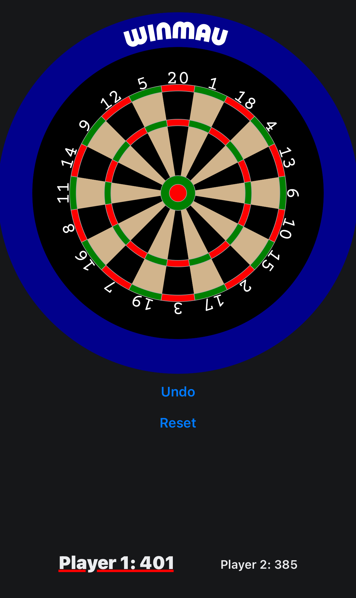
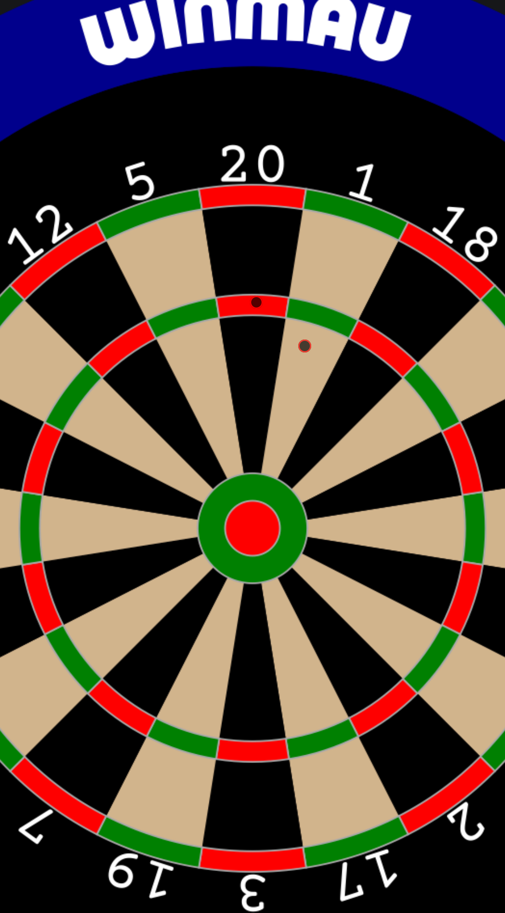

# Dart Scorer

|  |  |
| --- | --- |

## Description

A React Native app for scoring a game of X05 darts. The app renders a fully interactive dartboard using trigonometry for precise slice and multiplier ring placements. Supports pinch-to-zoom and pan gestures, as well as haptic feedback.

> **Status:** Functional, but still in development

## Get started

This is an [Expo](https://expo.dev) project created with [`create-expo-app`](https://www.npmjs.com/package/create-expo-app).

1. Install dependencies

   ```bash
   npm install
   ```

2. Start the app

   ```bash
   npx expo start
   ```

## Contact
For any inquiries or issues, please contact [Nolan Cyr](mailto:nolangcyr@gmail.com)